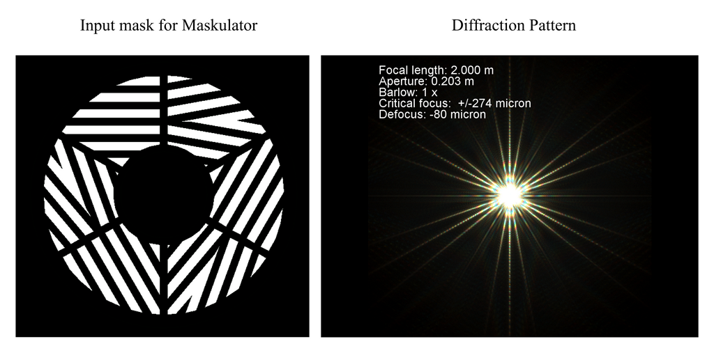

Language: English, <a href="translations/README_JA.md">Japanese</a>

# A Tri-Bahtinov Mask for Aiding Collimation and Focusing of Schmidt Cassegrain, Ritchey Chretien and Newtonian Telescopes

## Introduction

In my opinion, the Bahtinov mask is one of the most useful inventions
for astrophotography. The traditional use of a Bahtinov mask is for
focusing a telescope only and is not used for collimation of reflector
type telescopes like SCTs, RCs and Newtonians.
For collimating a reflector, the method that is commonly used is the
[Airy disk method](http://www.astrophoto.fr/collim.html). I have found
this method to be quite onerous because

* due to atmospherics at my observation location, I have never been able
to see a really clear diffraction pattern of the defocused star or Airy disk. 
* when I adjust the collimating screws to centre the doughnut hole, my
  judgement is rather arbitrary and not as objective as it should
  be. I think my overly optimistic judgement of the diffraction pattern
  makes this method a collimation challenge for me.

And thus, these two reasons motivated me to create a less judgemental
way for collimation.

## The idea

Since the standard Bahtinov mask is such a useful tool for focusing, I
thought that there must be a way to use it for collimation as
well. My idea when applied to an SCT is as follows:

For an SCT, that is well collimated, I would expect that the path
length travelled by light rays from the primary mirror reflected to
the secondary mirror and then reflected to the image plane should all
be the same. However, if the SCT is not collimated then the light rays
do not all have the same path lengths. The effect is that focus can
only be established at one location on the image plane, while focus is
not achieved at other locations.

Therefore, for an uncollimated SCT, while I can achieve perfect
Bahtinov diffraction spikes with one orientation of the Bahtinov mask,
the diffractions spikes will not be perfect for other
orientations. Thus, in my opinion, the most natural way to
simultaneously measure the focus for different orientations of the
Bahtinov mask is to make a mask that has multiple orientations
already built in.

## Tri-Bahtinov mask

For an SCT, the secondary mirror has three adjustment
screws. Therefore, the most obvious way to me is to have three
Bahtinov masks designed into the mask. Thus, my idea of a
**Tri-Bahtinov mask** that has three Bahtinov masks arranged in a
3-fold symmetric fashion. This symmetry should produce a diffraction
pattern that is also 3-fold symmetric. To check this hypothesis, I
generated the diffraction pattern using the program
[Maskulator](http://www.njnoordhoek.com/?p=376).  The diffraction
pattern from such a Tri-Bahtinov mask is shown below for the design
where the smallest angle between the diffraction spikes is 10
degrees. This simulation confirms my hypothesis that a Tri-Bahtinov
produces a diffraction pattern that has three orientations for
checking the focus.

## Implementation

I have made a Tri-Bahtinov mask for my 8" LX200 classic which I show below

The Tri-Bahtinov mask is mounted on my LX200 is shown below

I have mounted thumb screws on the mask so that when I use it, I orient
these screws to align with the collimation screws on the secondary
mirror. I can then mask one of the three Bahtinov sub-masks to determine which
collimation screw to adjust.

## Improved Tri-Bahtinov mask invented by S. Takagi

S. Takagi has improved the original mask which can be found
[here](http://svg2.mbsrv.net/astro/Tri-Bahtinov_symmetric.html). This
improved mask is more sensitive to any focus errors than the original
mask.

Although I don't show the results of the improved mask here, the
method for using the mask that is outlined in the
[wiki](https://github.com/cytan299/tribahtinov/wiki/A-Tri-Bahtinov-Mask-for-Aiding-Collimation-and-Focusing-of-Schmidt-Cassegrain-Telescopes)
is still applicable.

## Results

My as found diffraction pattern when I point my LX200 at Polaris,
magnified 400x and integrated for 0.5 seconds for the diffraction
pattern of the defocused star and 4
seconds for the Tri-Bahtinov are shown below

It is clear that my LX200 is badly mis-collimated from the 
diffraction pattern. For the Tri-Bahtinov diffraction pattern, I can
get two directions that are close to focus but in one Bahtinov spike orientation,
indicated in the picture, is clearly not in focus. In fact, this orientation is in the
same direction that the donut shadow that is also off-centered.

After using the collimation screws to move the diffraction pattern to the center
and using the Tri-Bahtinov mask to fine tune each orientation, I got 
my LX200 to be very well collimated (might still be a smidgen off from perfection)

Thus, my collimation exercise with the Tri-Bahtinov mask allowed
me to achieve collimation with minimal arbitrariness. This is the goal
that I wanted!

## Use on RCs and Newtonians

The contribution from the community at Cloudy Nights has been
tremendous! I had only thought of using the Tri-Bahtinov on my SCT,
but users like Richard (alias "frantolmy") and Satoru Takagi (alias
"Psittacula") have shown that the Tri-Bahtinov also works on RCs and
Newtonians. Please see their posts
[here](https://www.cloudynights.com/topic/536410-a-tri-bahtinov-mask-for-sct-collimation-and-focusing/)

## Tri-Bathinov Grabber

K. Evans' has created a [Tri-Bahtinov
Grabber program](https://github.com/1CM69/Tri-Bahtinov_Grabber) to
objectively help with focusing and collimation.

## Directory structure

* **ponoko** My Tri-Bahtinov mask that can be sent to
[Ponoko](http://www.ponoko.com) to be laser cut.
* **other_formats** My Tri-Bahtinov mask in other formats so that you
  can print it out or edit it. 
* **pics** Image files for this repository.
* **maskulator_movie** directory that contains the avi movie from
  maskulator that shows how the Tri-Bahtinov diffraction pattern
  changes when the focusing changes.
* **python** My python script
  for generating my Tri-Bahtinov mask for any telescope. Please see
  the README.md file in that directory for instructions how to install
  the required python libraries in order for _generate.py_ to work.
* **releases** For most users, you will download the executables for
  _Mac OS X_ and _Windows_ in the
  [releases](https://github.com/cytan299/tribahtinov/releases)
  directory.
* **cover_generator** The cover generators written in python that are
  useful when used in conjunction with K. Evans' [Tri-Bahtinov
Grabber program](https://github.com/1CM69/Tri-Bahtinov_Grabber). 
* **pre-made** There are pre-made masks in _svg_ format for some popular telescopes.
* **translations** Documents translated into languages other than
English are stored.

## How to use the mask

I have written the instructions for using the mask in the
[wiki](https://github.com/cytan299/tribahtinov/wiki/A-Tri-Bahtinov-Mask-for-Aiding-Collimation-and-Focusing-of-Schmidt-Cassegrain-Telescopes).

Satoru Takagi has posted instructions for collimating a Newtonian 
[here](https://www.cloudynights.com/topic/536410-a-tri-bahtinov-mask-for-sct-collimation-and-focusing/page-4). I
have reproduced his instructions in the [wiki](https://github.com/cytan299/tribahtinov/wiki/A-Tri-Bahtinov-Mask-for-Aiding-Collimation-and-Focusing-of-Schmidt-Cassegrain-Telescopes).

## Discussion group

There is an active discussion group that the I monitor. You can post
to
[Cloudy Nights::Equipment::A Tri-Bahtinov mask for SCT collimation and focusing](https://www.cloudynights.com/topic/536410-a-tri-bahtinov-mask-for-sct-collimation-and-focusing/)
to get community help.

## A Tri-Bahtinov mask generator on the web

Here's the link to a Tri-Bahtinov mask generator that is written by
Satoru Takagi:

[Satoru Takagi's Tri-Bahtinov mask generator](http://svg2.mbsrv.net/astro/Tri-Bahtinov.html)

Thanks to Satoru Takagi, you can use his webapp to generate the mask rather
than download and install my program to do this.

## Acknowledgements

I would like to thank Satoru Takagi (25 Jul 2017) for his contributions for
improving _generate.py_. His contributions added the following options
for the user:

* setting the stem width
* setting the ratio between the slit and stem widths.

Satoru has also invented an improved version of the Tri-Bahtinov which
can be found
[here](http://svg2.mbsrv.net/astro/Tri-Bahtinov_symmetric.html).

Ever since publication of the Tri-Bahtinov mask, the support from the
community has been fantastic. For example, K. Evans has created a [Tri-Bahtinov
Grabber program](https://github.com/1CM69/Tri-Bahtinov_Grabber) to
objectively help with focusing and collimation. As part of the support
for this program, I have written python cover generators for both the
original and improved Tri-Bahtinov masks.

## Copyright

All the documentation, pictures, movies and design that I have here is
copyright 2016 C.Y. Tan and released under Creative Commons
Attribution-ShareAlike 3.0 Unported License.

All software is released under GPLv3

