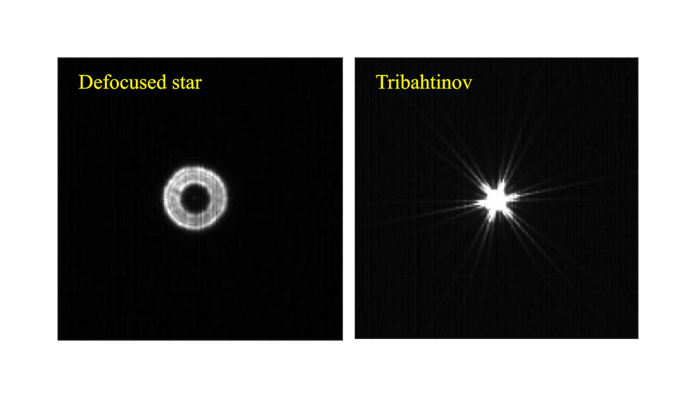

# トライ・バーティノフマスク:シュミットカセグレン望遠鏡の光軸合わせとピント合わせ支援のためのツール

## 前書き 

標準的なバーティノフマスクは天体写真で用いらるれ焦点合わせのための最も有用なツールの1つです。 しかし、それを三回対象にすること、すなわち2つの別の方向を向いたバーティノフマスクパターンをマスクに追加することで、もっと有用になると考えます。 それが「トライ・バーティノフマスク」と私が名付けたものです。  トライ・バーティノフマスクでは、シュミットカセグレン望遠鏡(SCT)の光軸がよく合っているかどうかをチェックする機能が追加されます。 以下は、任意のサイズのトライ・バーティノフマスクを生成する方法、およびそれを用いて光軸調整を行うための説明書です。 

## Satoru Takagiのwebappを使ってトライ・バーティノフマスクを生成する 

webAppにより、*generate*をインストールせずにブラウザからマスクを生成することができます。 彼のTri-Bahtinovマスクジェネレータへのリンクは以下のとおりです。 

 [Satoru Takagiのトライ・バーティノフマスクジェネレータ](http://svg2.mbsrv.net/astro/Tri-Bahtinov.html)

## ダウンロードしたプログラムてトライ・バーティノフマスクを生成する 

 トライ・バーティノフマスクは、 [リリースディレクトリ](https://github.com/cytan299/tribahtinov/releases)内の実行可能ファイルを使用して生成できます。*generate*をインストールするための説明書に従ってください。 

### マスク生成に必要な入力パラメータ (上記いずれの方法にも共通)

必要なパラメータは次のとおりです。 
* **focal length**(望遠鏡の焦点距離[mm]) ： スリットの数を多くしたり少なくしたりしたい場合、実際の焦点距離に対して入力する焦点距離を調節してください。 
* **outer radius**(マスクの外径[in] (webAppでは[mm]も選択可))： 望遠鏡の対物開口部内にマスクが入るように設定します。 
* **inner radius**(マスクの内径[in] (同上))： 光軸調整ネジにアクセスできるよう、副鏡セルをかわすように設定します。 

生成されるマスクは、3つのグラフィックス形式で提供されます。 
* **tribahtinov.pdf** pdf形式のtribahtinovマスク 
* **tribahtinov.png** png形式のtribahtinovマスク 
* **tribahtinov.svg** tribahtinovマスク（svg形式） （WebAppではこの形式のみサポート）

上記のマスク図面は、以下のパラメータで*generate*によって生成された例です 
* **focal length**(焦点距離): 1000mm
* **outer radius**(外径): 4インチ
* **inner radius**(内径): 1.5インチ

注：*generate*やwebAppで作成されるマスクに不要部分があります。 これは手で簡単に消去することができます。 

### 回折パターンのマスク・ムービー

[Maskulator](http://www.njnoordhoek.com/?p=376)によるシミュレーションで生成されたマスク振る舞いを確認できます。 このプログラムでは、フォーカスが変わると回折パターンがどのように変化するかを確認することができます。 作成したマスクと*Maskulator*で計算した回折パターンの例を下に示します。

*Maskulator*は、フォーカシングの際に回折パターンがどのように変化するかを示すムービーを生成することもできます。 

[Makulatorムービー ](../maskulator_movie/maskulator.mpeg)

## Tri-Bahtinovマスクを使用する 
* マスクを使用する前にエアリーディスクが概ね中央にあることを確認します。下に示すように、ドーナツの中心がかなりずれている（光軸が大幅にずれている）ことがあります 

このような場合は、マスクを使用するよりエアリディスクを見て影を中央に配置する方が効率的です。 

* 自分の指を対物開口部の前にかざし、それがエアリーディスク上に写った影を見ることで、どの光軸調整ネジがどの方向に対応するのかを確認します。 
* その後、マスクのノッチまたは白いつまみネジを光軸調整ネジに合わせて、マスクを対物開口部に設置します。 
* *(訳者注: マスクを置いた後、もう一度3つのバーティノフマスク部分を手などで覆い、マスクのどの部分がどの光条と対応するか確認すると良いでしょう)*

* 3方向のバーティノフ回折パターンのうちの1つに着目し、それが合焦した状態になるよう**合焦ノブで**調節します。 これを基準バーティノフ回折パターンと呼ぶことにします。 この段階で、おそらく他の2つの方向の回折パターンは合焦していない状態にあることを示しているでしょう。 
* 他の2つのバーティノフ回折パターンの方向に対応する**光軸調整ネジ**を使用して、それらが合焦するように調整します。 ここで、対応する調整ネジは、前のステップで指の影のテストによって決定されたものを用います。 
* 必要に応じて、基準バーティノフ回折パターンが完全に合焦するようにSCTの**合焦ノブで**再度調節します。さらに、満足いく結果が得られるまで、他の2つのバーティノフ回折パターンで前のステップを繰り返し、3方向の回折パターン全てが完全に合焦を示すよう調整します。 

## バグレポートと提案
あなたはバグや提案を[issuesタブ](https://github.com/cytan299/tribahtinov/issues)から投稿することができます。

## 著作権 

私が書いたすべてのソフトウェア、ドキュメント、ハードウェアはC.Y. Tanが著作権を持ちます。Copyright 2016 by C.Y. Tan. それらすべてのソフトウェアはGPLv3でリリースされます。またドキュメントはCreative Commons Attribution-ShareAlike 3.0 Unported Licenseで公開されます。 
